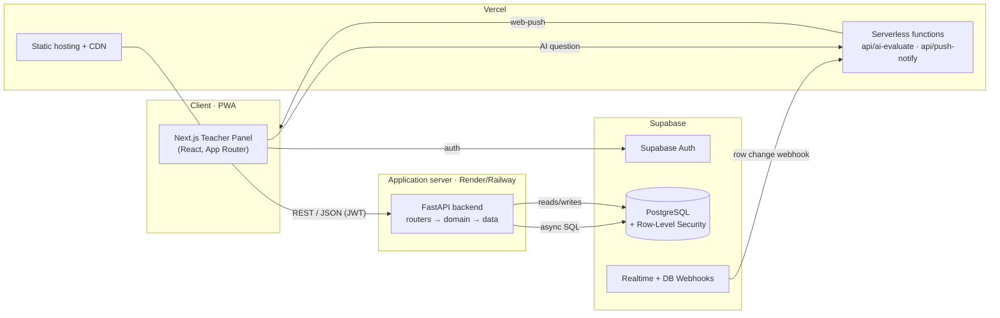
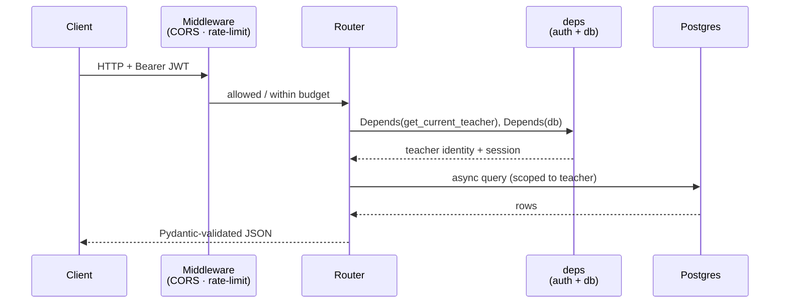

# AcadTrack Teacher Panel — Codebase Architecture & Conventions

> **What this document is.** A blueprint for *how the code is organized* and *why* —
> the folder architecture, the layering, and the security / scalability /
> maintainability principles that shape it. It is the companion to
> [`architecture.md`](./architecture.md) (which explains how the system behaves at
> runtime) and [`deploy.md`](./deploy.md) (which explains how it ships).
>
> New to the codebase? Read §1–§5. Reviewing a change? Check it against the
> **Conventions** boxes. Planning the next quarter of work? See §12.

---

## Table of Contents
1. [Guiding principles](#1-guiding-principles)
2. [System at a glance](#2-system-at-a-glance)
3. [Repository layout](#3-repository-layout)
4. [Frontend architecture (Next.js)](#4-frontend-architecture-nextjs)
5. [Backend architecture (FastAPI)](#5-backend-architecture-fastapi)
6. [Database architecture (Supabase / Postgres)](#6-database-architecture-supabase--postgres)
7. [API surface](#7-api-surface)
8. [Security architecture](#8-security-architecture)
9. [Scalability architecture](#9-scalability-architecture)
10. [Maintainability](#10-maintainability)
11. [Environments & deployment](#11-environments--deployment)
12. [Roadmap — levelling up further](#12-roadmap--levelling-up-further)

---

## 1. Guiding principles

These five principles explain every structural decision below. When in doubt, a
change should make one of them *more* true, never less.

| Principle | What it means here |
| --- | --- |
| **Separation of concerns** | Each layer has one job. UI never talks to the database; HTTP handlers never contain business rules that belong in a domain module. |
| **Single source of truth** | A rule or value is defined **once** and imported everywhere. Grades come only from `lib/grading.ts`; config only from `lib/config.ts` / `app/config.py`. |
| **Secure by default** | The safe path is the easy path: auth is enforced by a shared dependency, the database is closed by Row-Level Security, secrets live only in env vars. |
| **Stateless & scalable** | The backend keeps no per-user state in memory, so it can run as many identical instances as traffic needs. State lives in Postgres (durable) or Redis (ephemeral, optional). |
| **Convention over configuration** | Folders and filenames follow one predictable pattern, so a new file has an obvious home and a reader has an obvious place to look. |

---

## 2. System at a glance

AcadTrack is a **three-tier web application** (client → API → database) with a
small set of **serverless functions** for edge/event work. Two independently
deployable panels (Teacher and Facilitator) share one database.



**Reading the diagram.** The browser renders the Next.js app (served by Vercel's
CDN), authenticates against Supabase, and calls the FastAPI backend for all data.
The backend is the *only* writer of business logic; Supabase is the durable store.
Two serverless functions handle the jobs that don't belong on the always-on
backend: proxying the paid AI endpoint and fanning out push notifications when the
database changes.

---

## 3. Repository layout

A **polyrepo-style monorepo**: one Git repository, but each deployable unit
(`frontend/`, `backend/`, `api/`) is self-contained with its own dependencies and
deploy target. This keeps the two runtimes (Node and Python) cleanly separated
while letting them evolve together in one pull request.

```text
teacher-panel/
├── frontend/            # Next.js app  → deploys to Vercel
├── backend/             # FastAPI API  → deploys to Render/Railway
├── api/                 # Vercel serverless functions (edge/event work)
├── docs/                # architecture.md · deploy.md · CODEBASE.md (this file)
├── .github/workflows/   # keep-warm.yml (cron ping so the free dyno stays warm)
├── render.yaml          # backend deploy descriptor
├── package.json         # root — dependencies for the api/ functions
└── requirements.txt     # root — Python shim required by the Render builder
```

> **Convention.** Anything that ships to a runtime lives under that runtime's
> folder. Root-level files are *only* deploy descriptors and shims — never
> application code.

---

## 4. Frontend architecture (Next.js)

**Next.js 14, App Router, TypeScript, React.** The frontend is a layered PWA where
each folder is one layer, and imports only ever point *downward* (a page may use a
lib module; a lib module never imports a page).

```text
frontend/
├── app/                        # ROUTES — the only place URLs are defined
│   ├── (teacher)/              #   authenticated route group, wrapped by one shell
│   │   ├── layout.tsx          #     TeacherShell (sidebar, top-bar, auth gate)
│   │   ├── dashboard/          #     one folder = one route
│   │   ├── section/            #     list  + [id]/ detail (dynamic segment)
│   │   ├── class-record/       #     list  + [id]/ the grade grid + breakdown
│   │   ├── attendance/         #     list  + [id]/
│   │   ├── performance/        #     list  + [id]/ analytics
│   │   ├── facilitators/  grading-system/  about/  help/
│   ├── login/  sign/           # PUBLIC auth pages (outside the group)
│   ├── privacy/  terms/        # legal
│   ├── layout.tsx              # root layout — metadata, fonts, <html>
│   └── page.tsx                # entry → redirects to /dashboard or /login
├── components/                 # REUSABLE UI — presentational, no data fetching
│   └── TeacherShell · LoadingBar · AIAssistant · QuickAddFab · SectionPickerList · Skeleton
├── hooks/                      # REACT STATE — useAuth (session gate), use-cached-data
├── lib/                        # DOMAIN / SERVICES — the app's brain, framework-free
│   ├── api.ts                  #   the single HTTP client (adds JWT, base URL, errors)
│   ├── supabase.ts             #   Supabase client singleton
│   ├── config.ts               #   env-derived constants (API base, keys)
│   ├── grading.ts              #   ⭐ single source of truth for grade math
│   ├── export.ts               #   Excel generation
│   ├── theme.ts  ai.ts  page-meta.tsx
└── public/                     # STATIC — logo, manifest.json (PWA)
```

**The layer contract**

| Layer | May import | Must never | Job |
| --- | --- | --- | --- |
| `app/` | components, hooks, lib | be imported by anything | Define routes, compose the page |
| `components/` | hooks, lib | fetch data or know a URL | Render UI from props |
| `hooks/` | lib | render markup | Own React state / side-effects |
| `lib/` | (only other lib) | import React components | Talk to the outside world; hold domain rules |

> **Conventions.**
> - **One route = one folder** under `app/`. Dynamic detail pages live in `[id]/`.
> - **All network calls go through `lib/api.ts`** — never `fetch()` in a component.
>   This is where auth headers, the base URL, retries, and error shape live *once*.
> - **Grades come only from `lib/grading.ts`.** Every screen and the Excel export
>   call the same function, so a teacher, a facilitator, and a spreadsheet can
>   never disagree.
> - **Styling** is co-located CSS per route (`class-record/[id]/detail.css`) plus a
>   few shared sheets (`globals.css`, `teacher-shell.css`).

---

## 5. Backend architecture (FastAPI)

**FastAPI, async SQLAlchemy, Pydantic v2.** A classic layered API: an HTTP edge, a
data-shape layer, and a core of cross-cutting concerns. Requests flow
`router → (domain logic) → models/schemas → database`.

```text
backend/
├── app/
│   ├── main.py         # APP FACTORY — builds the app, wires middleware,
│   │                   #   registers every router. The one entry point.
│   ├── routers/        # HTTP EDGE — one module per domain, thin handlers
│   │   └── sections · records · grading · dashboard · facilitators · ai · push
│   ├── schemas.py      # CONTRACT — Pydantic request/response models (validation)
│   ├── models.py       # DATA — SQLAlchemy ORM tables
│   ├── database.py     # async engine + session factory
│   ├── deps.py         # DEPENDENCY INJECTION — get_current_teacher, db session
│   ├── security.py     # auth primitives — JWT decode/verify, bcrypt
│   ├── config.py       # settings from environment (no hard-coded secrets)
│   ├── ratelimit.py    # SlowAPI limiter (per-user buckets, fail-open)
│   └── utils.py        # small shared helpers
├── sql/                # DATABASE MIGRATIONS — ordered, idempotent .sql files
│   └── 001_performance_indexes.sql
├── requirements.txt · runtime.txt · railway.json   # deps + deploy
```

**Request lifecycle**



> **Conventions.**
> - **Routers stay thin.** A handler validates input (Pydantic), calls the work,
>   and returns a schema. Non-trivial business logic that grows past a handler
>   belongs in a dedicated domain module (see §12).
> - **Auth is a dependency, not a check you remember to write.** Every protected
>   route declares `Depends(get_current_teacher)`; forgetting it fails closed
>   because there is no data access without the injected, teacher-scoped session.
> - **Never `import os` for a secret inside a router.** All configuration is read
>   once in `config.py`.
> - **The schema is the contract.** If the JSON shape changes, `schemas.py` changes
>   first; the database and the frontend follow.

---

## 6. Database architecture (Supabase / Postgres)

The database is the system's durable **source of truth**. Everything else is
replaceable; the data is not.

- **Managed Postgres (Supabase)** with **Row-Level Security (RLS)** as the primary
  authorization boundary. A teacher's token can only ever read/write that
  teacher's rows — even a bug in the API cannot cross tenants, because the
  *database itself* refuses.
- **Migrations live in `backend/sql/`** as ordered, idempotent `.sql` files
  (`001_…`, `002_…`). They are the reviewable, replayable history of the schema.
- **Performance is designed in:** foreign keys and hot query columns are indexed
  (`001_performance_indexes.sql`) so reads stay fast as rows grow into the
  millions.

> **Convention.** Schema changes ship as a **new** numbered file in `sql/` — never
> by editing an old one — so any environment can be brought up to date by replaying
> the folder in order.

---

## 7. API surface

Two kinds of server code, chosen by *lifetime*, not by preference:

| Surface | Lives in | Use it for | Example |
| --- | --- | --- | --- |
| **Application API** | `backend/` (FastAPI) | Anything stateful, authenticated, or on the hot path | `GET /api/sections`, `POST /api/records` |
| **Serverless function** | `api/` (Vercel) | Short, event-driven, or edge work that shouldn't tie up the always-on backend | `api/push-notify` (fired by a DB webhook), `api/ai-evaluate` (proxies the paid AI provider) |

> **Rule of thumb.** If it needs the database session and a logged-in teacher, it's
> a backend router. If it's triggered by an event (a webhook) or is a thin proxy to
> a third party, it's a serverless function.

---

## 8. Security architecture

Security is layered so that no single mistake is fatal — *defense in depth*.

| Layer | Control |
| --- | --- |
| **Identity** | Supabase Auth issues JWTs; the backend verifies signature + expiry in `security.py` before any handler runs. |
| **Authorization (app)** | `deps.get_current_teacher` scopes every query to the caller; a route without it has no data access. |
| **Authorization (data)** | **Row-Level Security** in Postgres is the backstop — the database enforces tenancy even if the app layer is wrong. |
| **Abuse / DoS** | `ratelimit.py` — generous per-*user* buckets, a tighter budget on the paid AI route, **fail-open** so a limiter hiccup never blocks a real teacher. |
| **Secrets** | Only ever in environment variables (`.env.example` documents the shape; real values never enter Git). |
| **Transport / CORS** | HTTPS everywhere; an explicit CORS middleware allow-list, applied as the outermost layer so even a 429 carries the right headers. |
| **Input** | Pydantic validates and coerces every request body at the edge; malformed input is rejected before it reaches logic. |

> **Convention.** New endpoint ⇒ it declares `get_current_teacher`, its table has an
> RLS policy, and its inputs are a Pydantic schema. Three boxes, every time.

---

## 9. Scalability architecture

The app is built to grow from one classroom to hundreds of thousands of records
without a rewrite.

- **Stateless backend.** No per-user memory ⇒ run N identical instances behind one
  URL and load-balance freely.
- **Shared, not sticky, state.** The rate limiter defaults to in-memory (correct
  for one instance) and can switch to **Redis** with a single env var to stay
  consistent across many instances — the code is already Redis-ready.
- **Indexed reads + bounded queries.** Hot columns are indexed and list endpoints
  are paginated/limited, so latency stays flat as data grows.
- **CDN edge.** The static frontend is served from Vercel's global CDN; only data
  calls reach the backend.
- **Keep-warm.** A 5-minute cron ping (`.github/workflows/keep-warm.yml`) hides the
  free tier's cold start.

---

## 10. Maintainability

The structure is optimized so the *next* engineer (or the same one in six months)
can move quickly and safely.

- **Predictable homes.** The conventions above mean a new file has one obvious
  location and a reader has one obvious place to look.
- **Single sources of truth** (`grading.ts`, `config.*`) mean a rule changes in one
  place and can't drift.
- **Typed end to end.** TypeScript on the frontend, Pydantic + type hints on the
  backend — many mistakes are caught before runtime.
- **Documented.** This file (structure), `architecture.md` (behavior), and
  `deploy.md` (operations) cover the three questions a newcomer asks.

---

## 11. Environments & deployment

| Piece | Platform | Trigger |
| --- | --- | --- |
| `frontend/` | Vercel (CDN + serverless for `api/`) | push to `main` |
| `backend/` | Render / Railway | push to `main` (watch `backend/**`) |
| database | Supabase (managed Postgres) | migrations replayed from `sql/` |

Configuration is entirely environment-driven; `.env.example` files document every
variable each unit needs. See [`deploy.md`](./deploy.md) for the full runbook.

---

## 12. Roadmap — levelling up further

The current structure is solid for today's size. These are **optional**,
prioritized steps to harden it further as the team and traffic grow — each is
independent and low-risk to adopt incrementally.

| Priority | Improvement | Why |
| --- | --- | --- |
| **High** | **Automated tests** — `backend/tests/` (pytest) for grading + auth; a few Playwright smoke tests on the frontend | The single biggest safety net for confident refactors |
| **High** | **CI pipeline** (GitHub Actions) — lint + type-check + tests on every PR | Catches regressions before they reach `main` |
| **Medium** | **Backend `services/` layer** — move non-trivial business logic out of routers into `app/services/` | Keeps handlers thin as features grow; makes logic unit-testable |
| **Medium** | **Frontend `types/` module** — shared TypeScript interfaces mirroring the API schemas | One definition of a `Section` / `Record`, shared by every screen |
| **Medium** | **Split `models.py` / `schemas.py`** into a package (`models/`, `schemas/`) once they pass a few hundred lines | Readability at scale |
| **Low** | **Error monitoring** (e.g. Sentry) on both tiers | See failures in production before users report them |
| **Low** | **Pre-commit hooks** (ruff/black, eslint/prettier) | Formatting never reaches review |

> None of these change how the app *behaves* — they make it faster and safer to
> *change*. Adopt them when the pain they solve becomes real, not before.

---

*This document describes the codebase as organized today and the conventions that
keep it professional, secure, scalable, and maintainable. Keep it in sync with the
structure — a PR that moves a boundary should update the relevant section here.*
